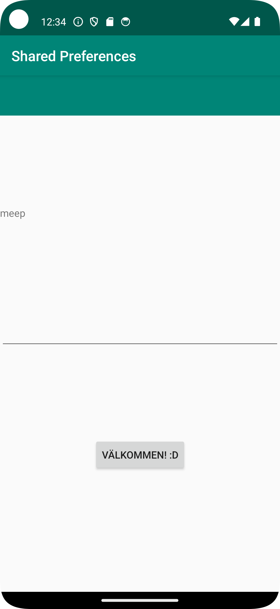

# Rapport
Det första som gjordes var att skapa en andra layout med en till java activity till layouten. I denna layout finns en textview, en edittext och en button.
Denna nya layout kan öppnas genom en knapp på första sidan.

I edittext på andra sidan kan man skriva in en text och den kommer att visas upp i textviewn och med hjälp av savpref kommer detta att sparas även om man stänger ner appen. 
För att få den att även visas på första layouten används en onresume som gör att texten även visas i textviewn på första sidan. 
```
 public void savePref(View v){

        EditText newPrefText=new EditText(this);
        newPrefText=(EditText)findViewById(R.id.settingseditview);

        myPreferenceEditor.putString("MyAppPreferenceString", newPrefText.getText().toString());
        myPreferenceEditor.apply();

        TextView prefTextRef=new TextView(this);
        prefTextRef=(TextView)findViewById(R.id.prefText);
        prefTextRef.setText(myPreferenceRef.getString("MyAppPreferenceString", "No preference found."));

        newPrefText.setText("");
    }
```

```
protected void onResume() {
        super.onResume();
        super.onResume();
        myPreferenceRef = getSharedPreferences("MyAppPreferenceString", MODE_PRIVATE);
        myPreferenceEditor = myPreferenceRef.edit();


        TextView prefTextRef=new TextView(this);
        prefTextRef=(TextView)findViewById(R.id.textview1);
        prefTextRef.setText(myPreferenceRef.getString("MyAppPreferenceString", "No preference found."));
        Log.d("Hej", myPreferenceRef.getString("MyAppPreferenceString", "No preference found."));
    }

```

Bilder läggs i samma mapp som markdown-filen.




Läs gärna:

- Boulos, M.N.K., Warren, J., Gong, J. & Yue, P. (2010) Web GIS in practice VIII: HTML5 and the canvas element for interactive online mapping. International journal of health geographics 9, 14. Shin, Y. &
- Wunsche, B.C. (2013) A smartphone-based golf simulation exercise game for supporting arthritis patients. 2013 28th International Conference of Image and Vision Computing New Zealand (IVCNZ), IEEE, pp. 459–464.
- Wohlin, C., Runeson, P., Höst, M., Ohlsson, M.C., Regnell, B., Wesslén, A. (2012) Experimentation in Software Engineering, Berlin, Heidelberg: Springer Berlin Heidelberg.
